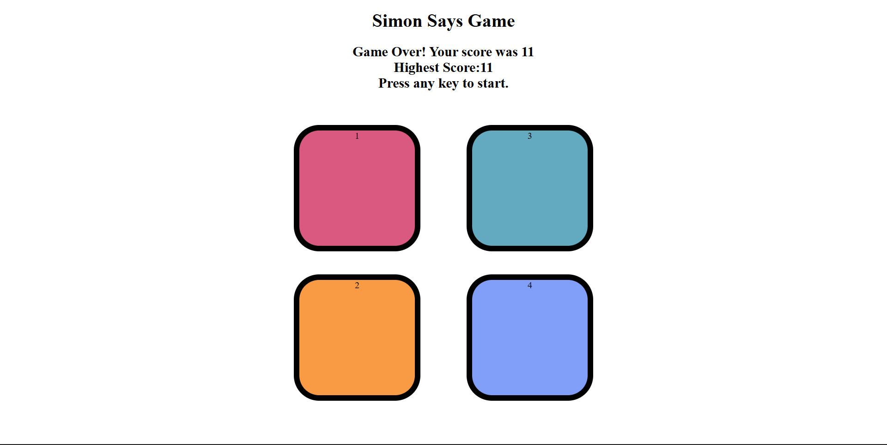

# 🎮 Simon Says Game

A simple and interactive **Simon Says Memory Game** built using **HTML, CSS, and JavaScript**.

The game tests your memory by generating a sequence of colored buttons. Your goal is to remember and repeat the sequence correctly. Each successful round increases the sequence length, making the game progressively more challenging.

---

## 🚀 Features

- 🎯 Random color sequence generation
- 📈 Increasing difficulty with each level
- 🖱️ Interactive button animations
- 💡 Visual feedback for game and user clicks
- 🏆 Tracks the highest score during the current session
- ❌ Game over detection with restart option
- 🎨 Clean and responsive user interface

---

## 🛠️ Technologies Used

- HTML5
- CSS3
- JavaScript (Vanilla JS)

---

## 📂 Project Structure

```
Simon-Say-Game/
│
├── Game.html      # Main HTML file
├── Game.css       # Styling
├── Game.js        # Game logic
└── README.md
```

---

## 🎮 How to Play

1. Clone or download the repository.
2. Open **Game.html** in your preferred web browser.
3. Press any key to start the game.
4. Watch the highlighted color carefully.
5. Repeat the sequence by clicking the buttons in the correct order.
6. Each completed level adds a new color to the sequence.
7. The game ends if you click the wrong button.
8. Try to beat your highest score!

---

## 📸 Preview



> Replace the image above with a screenshot of your game.

---

## 🔮 Future Improvements

- 🔊 Add unique sound effects for each button
- 💾 Save the highest score using Local Storage
- 📱 Improve mobile responsiveness
- 🌙 Add Dark Mode
- 🎬 Smoother animations and transitions
- ⏱️ Add multiple difficulty levels
- 🎮 Implement a Strict Mode similar to the classic Simon game

---

## 💻 Installation

Clone the repository:

```bash
git clone https://github.com/atherr977/Simon-Say-Game.git
```

Open the project folder and launch:

```
Game.html
```

in your preferred web browser.

---

## 👨‍💻 Author

**Athar Ashraf**

GitHub: https://github.com/atherr977

---

⭐ If you like this project, consider giving it a star!
